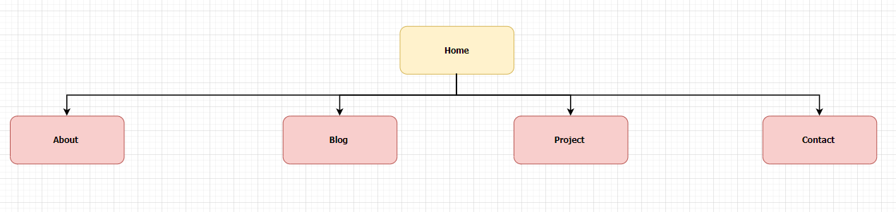
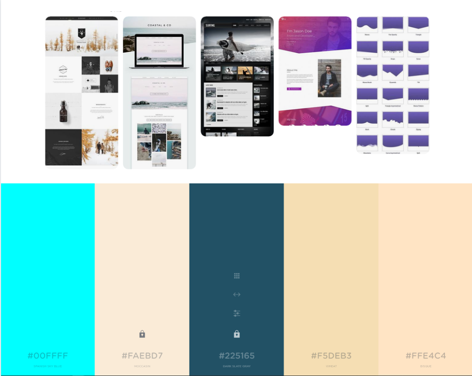
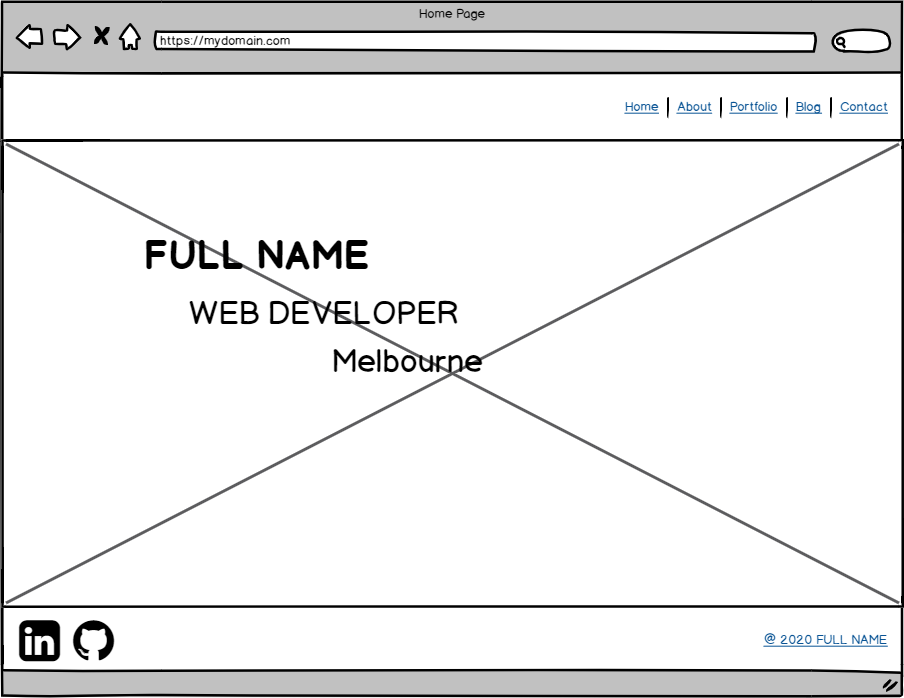
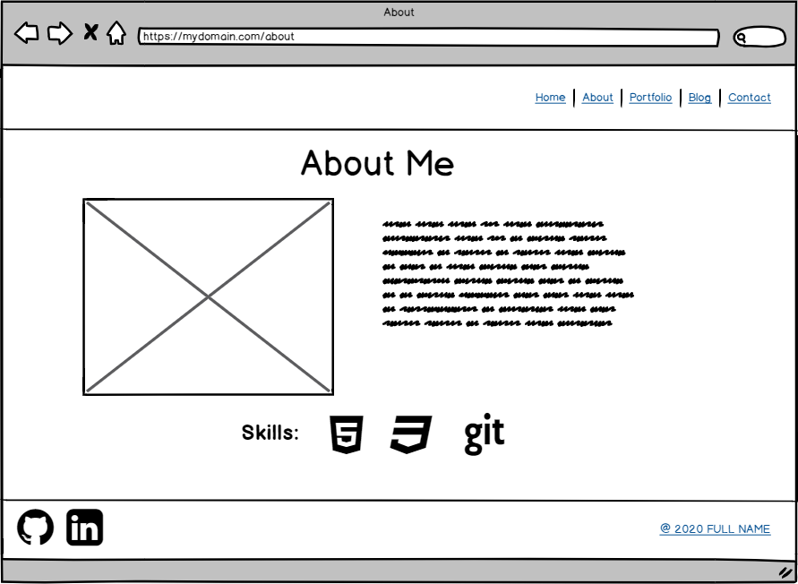
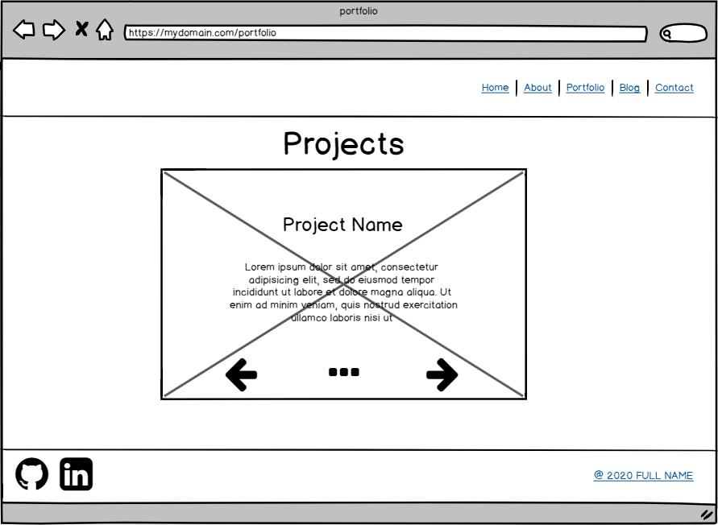
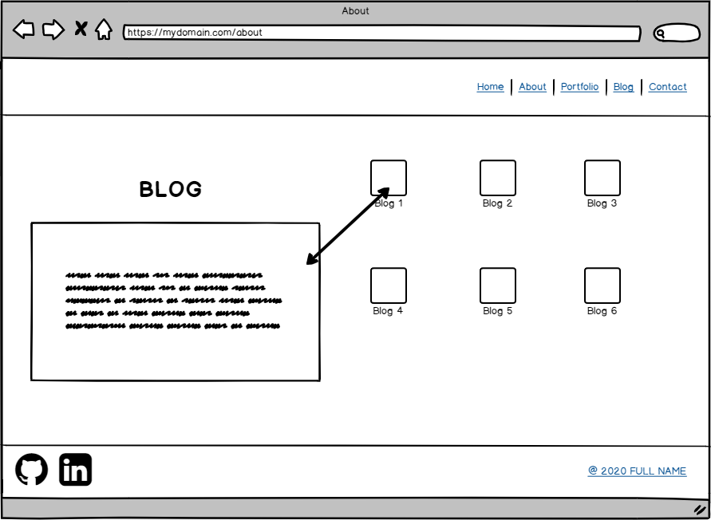
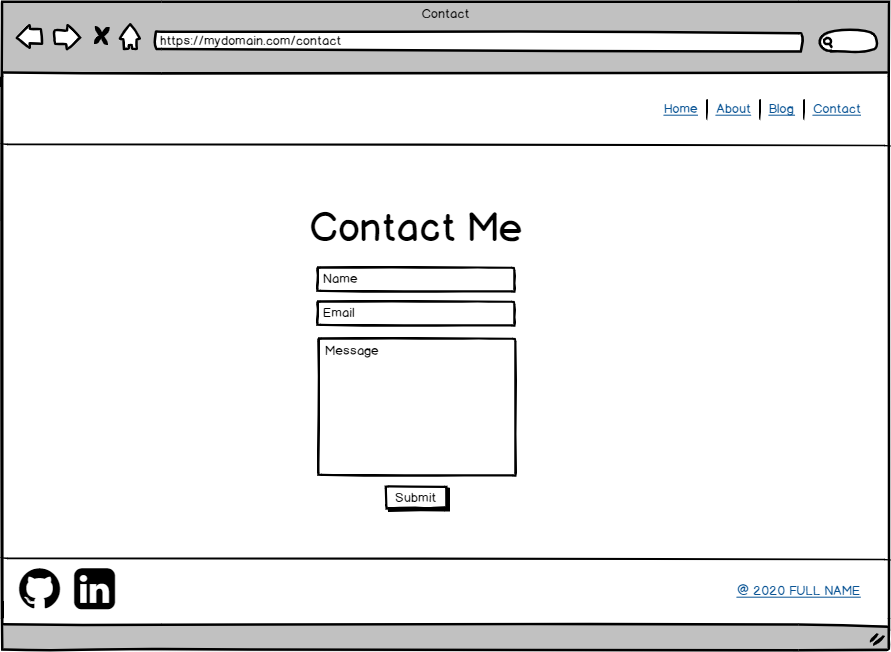
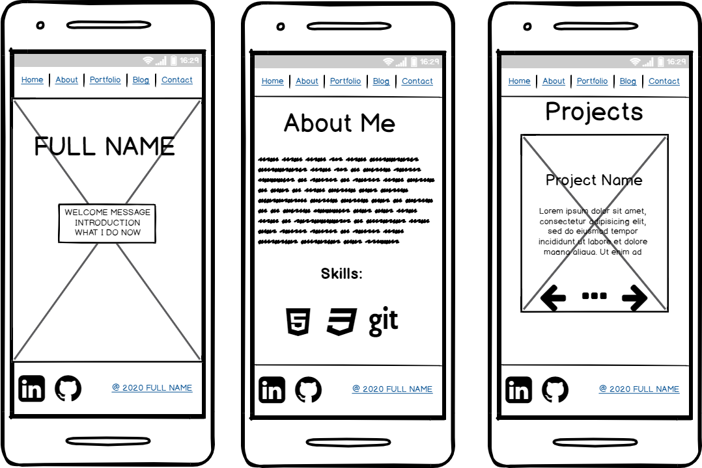
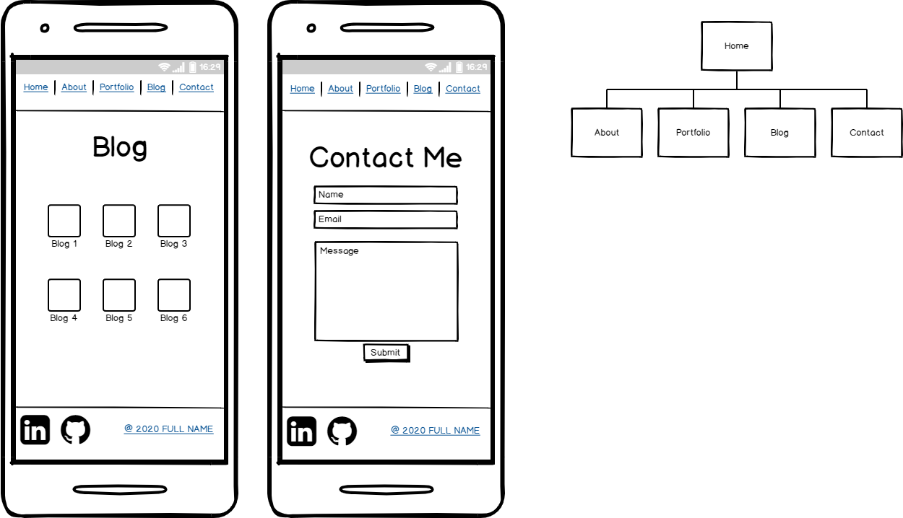

# **Portfolio Website - T1A3**

Website: https://pingnge.netlify.com/
github: https://github.com/ping-n/portfolio-project

## **Purpose** 

The purpose of this portfolio website is to demonstrate what I've learn in class and putting to it practical use. The portfolio website will be mainly use to display my skills, interests, my goals and my work experience to potential recruiter or partner in future projects. A portfolio website is a way for developer to build their own personal brand, as an junior developer the portfolio website is a reflective of your skills as a developer and how quickly you can learn and develop new skills in the future.

Websites are being access million of times a day, more than 50% of web traffic is on mobile which continue to climb as mobile phone become bigger and more powerful. As a web developer we have to make plans and changes design so that your website is mobile-friendly thus enable your portfolio website to be accessible on more platform than just web browser.

## **Features and Functionality** 

### **Navigation Bar**

The main navigation through the website is done through the navigation bar which is located at the top of the page, each navigation link will take the user to the appropriate html page. The landing page of the website is Home page which way branch off according to user selection, the navigation links are Home, About, Project, Blog and Contact. The navigation links will in cream color text that transition to aqua once the user their mouse hover on top of it indicating a clickable link.

### **Footer**

Each html page will feature the same footer with social media icons on the left side and a copyright symbol on the right. Keeping true to the theme of the links, once the social media icon is hover on, it will transition into aqua taking the user to teh appropriate social media profile while the copyright icon will link the user to my contact page.

### **Resume download button**

The resume button is located under the main heading on the home which transition into aqua and allow the user to click it which will take open my resume in another tab, there the user can browse my resume for information and download it if they desire.

### **Project cards**

The project page will include each my of major project in a card container that rotate to show text upon being hover upon. The front card will be a screenshot of the project while the back card will provide a short description about the project. 

### **Blog page**

The blog page display each in slider that expand to reveal the blog content for specific date, i wanted to create a fun design that represent as multiple book stack in a bookcase. The individual blog expanding is represent opening a book and finding the adventure that took place. The only problem with such design is that is not mobile friendly as the element is squish together as the screen get smaller. The only way way to fix this problem is to make a different layout style when the user is accessing the website from mobile but it take away from the user experience.

### **Consistent Design**

The main concept for this portfolio website was to introduce the the user to who I am such as my skills and interests, and background. 

- The colour palette remain the same throughout the website with the navigation bar and footer remain consistent throughout different html pages
- The background images changes as it represent my hobbies for traveling across Asia. Melbourne is selected for the home page because it is my current location, Cambodia for the about page as it is my birthplace. Thailand and Japan is the background image for blog and project page as those are my two favorite country to visit in Asia.
- Semantic Html was use throughout the coding process to make it easier for recruiter or other developer to read my code and see my logic and help make their decision in regard to hiring me in the future or to collaborate on projects. 

## **Design Process**

### **Site Map**

The site map below show links accessible within the main navigation bar.

### **Mood board and Colour**

The image below show a brief overview of though process in selecting the design for the website.

### **Wireframe**

#### Landing Page

#### About Page

#### Project Page

#### Blog Page

#### Contact Page

#### Mobile

