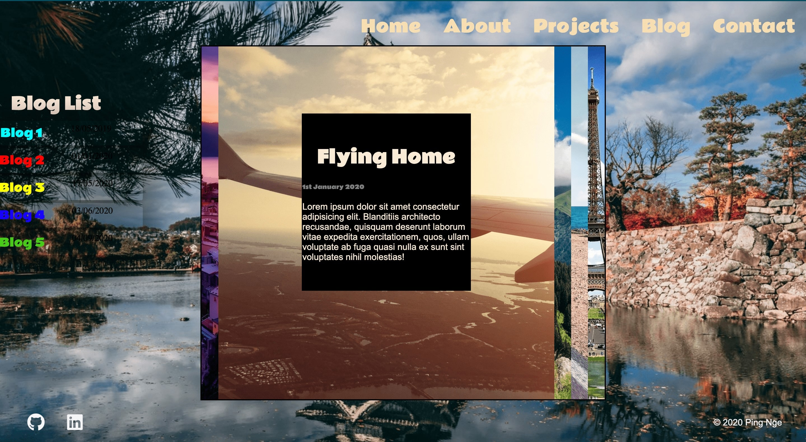
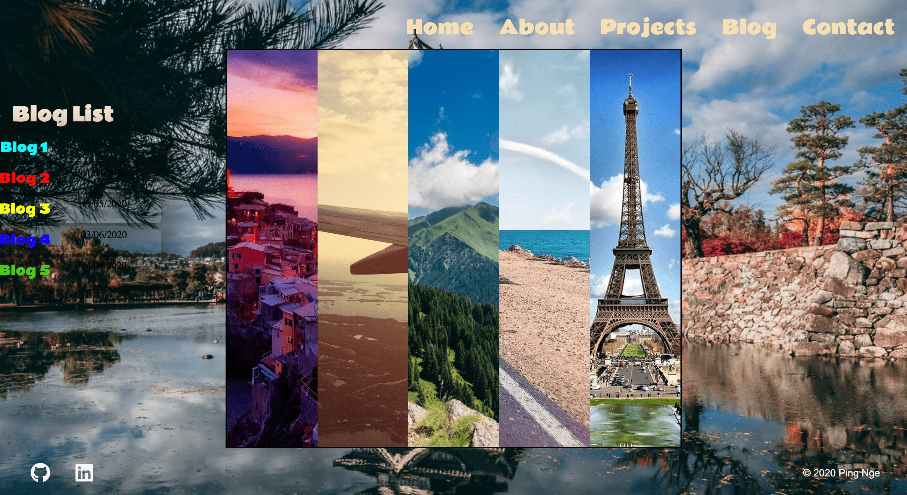
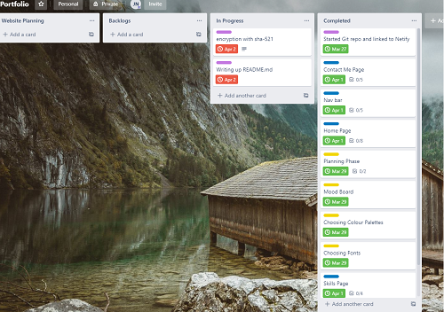
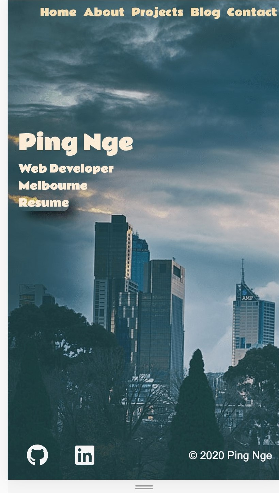
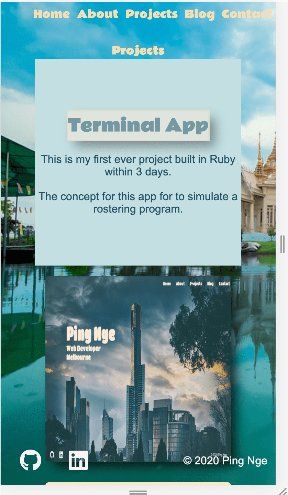

# **Portfolio Website - T1A3**

Website: https://pingnge.netlify.com/

github: https://github.com/ping-n/portfolio-project

## **Purpose**

The purpose of this portfolio website is to demonstrate what I've learn in class and putting to it practical use. The portfolio website will be mainly use to display my skills, interests, my goals and my work experience to potential recruiter or partner in future projects. A portfolio website is a way for developer to build their own personal brand, as an junior developer the portfolio website is a reflective of your skills as a developer and how quickly you can learn and develop new skills in the future.

Websites are being access million of times a day, more than 50% of web traffic is on mobile which continue to climb as mobile phone become bigger and more powerful. As a web developer we have to make plans and changes design so that your website is mobile-friendly thus enable your portfolio website to be accessible on more platform than just web browser.

## **Features and Functionality**

### **Navigation Bar**

The main navigation through the website is done through the navigation bar which is located at the top of the page, each navigation link will take the user to the appropriate html page. The landing page of the website is Home page which way branch off according to user selection, the navigation links are Home, About, Project, Blog and Contact. The navigation links will in cream color text that transition to aqua once the user their mouse hover on top of it indicating a clickable link.

### **Footer**

Each html page will feature the same footer with social media icons on the left side and a copyright symbol on the right. Keeping true to the theme of the links, once the social media icon is hover on, it will transition into aqua taking the user to the appropriate social media profile while the copyright icon will link the user to my contact page.

### **Resume download button**

The resume button is located under the main heading on the home which transition into aqua and allow the user to click it which will take open my resume in another tab, there the user can browse my resume for information and download it if they desire.

### **Project cards**

The project page will include each my of major project in a card container that rotate to show text upon being hover upon. The front card will be a screenshot of the project while the back card will provide a short description about the project.

### **Blog page**

The blog page display each in slider that expand to reveal the blog content for specific date, i wanted to create a fun design that represent as multiple book stack in a bookcase. The individual blog expanding is represent opening a book and finding the adventure that took place. The only problem with such design is that is not mobile friendly as the element is squish together as the screen get smaller. The only way way to fix this problem is to make a different layout style when the user is accessing the website from mobile but it take away from the user experience.

### **Consistent Design**

The main concept for this portfolio website was to introduce the the user to who I am such as my skills and interests, and background.

- The colour palette remain the same throughout the website with the navigation bar and footer remain consistent throughout different html pages
- The background images changes as it represent my hobbies for traveling across Asia. Melbourne is selected for the home page because it is my current location, Cambodia for the about page as it is my birthplace. Thailand and Japan is the background image for blog and project page as those are my two favorite country to visit in Asia.
- Semantic Html was use throughout the coding process to make it easier for recruiter or other developer to read my code and see my logic and help make their decision in regard to hiring me in the future or to collaborate on projects.

### **Sub-resource Integrity**

Sub-resource integrity (SRI) ensure that your linked file is protect from hacker inserting malicious Javascript in the css file of your website which can be use to steal information from those who visit the Portfolio page. I have implemented Sha-512 br creating in a hash in shell script terminal, this ensure that the css linked to the website only load identical when the hash is created otherwise the web browser will now render the css file attached to the html.

### ** Git Branching**

I have create multiple branch while creating this website to ensure there are multiple version to fall back in case they were a major bug in the code or to go back to make changes to different aspect of the site. I have created an alternate layout for my blog page to try and make it more responsive to mobile user, however since it is still a work in progress I have chosen to stick to the original design which is my prefer layout.

branch includes

- font changes
- grid for about me
- color palette experiments
- blog layout change
- One for my Window personal computer
- One for my Macbook laptop

## **Design Process**

### **Site Map**

The site map below show links accessible within the main navigation bar. The site map is keep simple because this layout is clean in term of design and give the user a straight path to what they select. Not shown on the site map is links to my social media page which are accessible via the social media icon in the footer, and the download button in the home page for viewing/downloading my resume.

### **Mood board and Colour**

The image below show a brief overview of though process in selecting the design for the website.

### **Project Management**

For this project I have use a few tools to create layout for my design and manage my time working on the portfolio.

Below are my wireframes of the website which highlight my original though process when designing the webpages.

#### Landing Page

#### About Page

#### Project Page

#### Blog Page

#### Contact Page

#### Mobile

#### Trello

Trello links : https://trello.com/b/DN4TotVe/portfolio

#### Screenshots

Showing some aspect of the site in mobile view

## **Target Audience**

The portfolio website was create with main to impress my potential employer, the main objective is to highlight the skills that i learnt for learning and coding HTML and CSS. I have chosen to emphasis this objective by teaching myself how to proficiently implement the webpages through flex-box in CSS and using semantic html for better readability. I have specifically chosen to implement key features such as the flip-card animation and slider for my blog pages to highlight my ability to quickly learn and implement skills.

Main target audience

- Employer
- HR recruiter
- Project Lead
- Freelancer who wish to cooperate on projects.

## **Tech Stack**

- HTML is used to implement basic structure of the webpages
- CSS is used to add layout, color and images to the webpages
- Formspree to get the contact details of user who wish to contact me
- Netlify to host the website
- Git for committing and making copy of the project when changes were made
- GitHub to store the code repository which allow me to share the code online

### Thank you for reading :)
## **End**